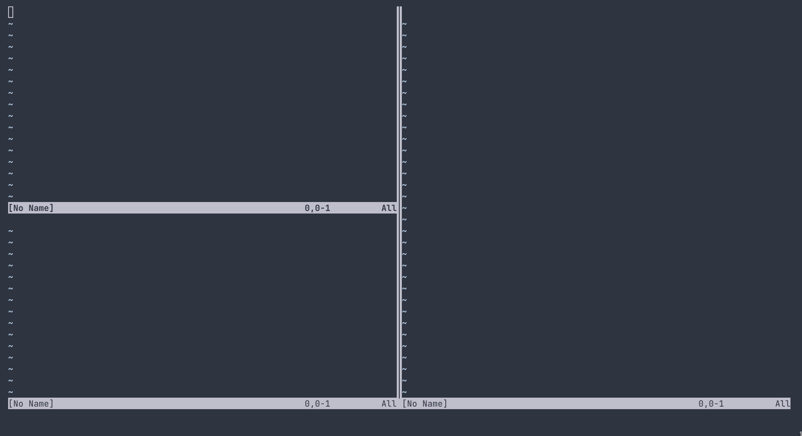
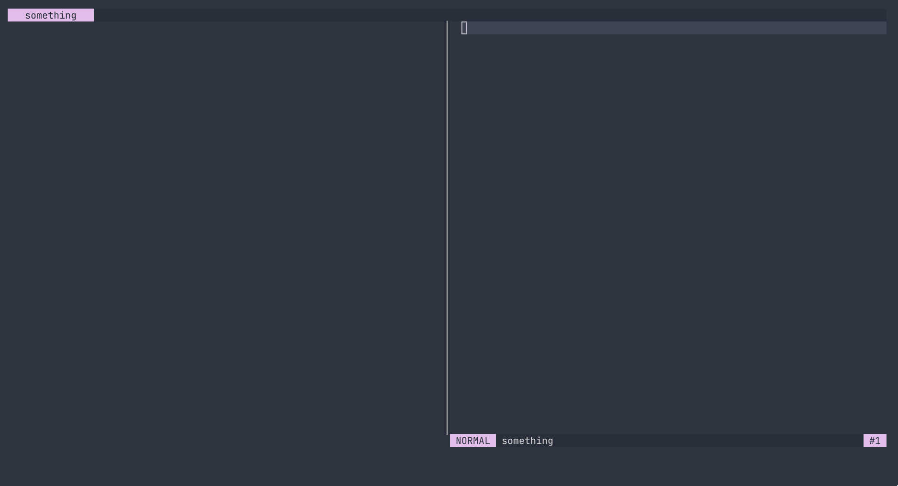
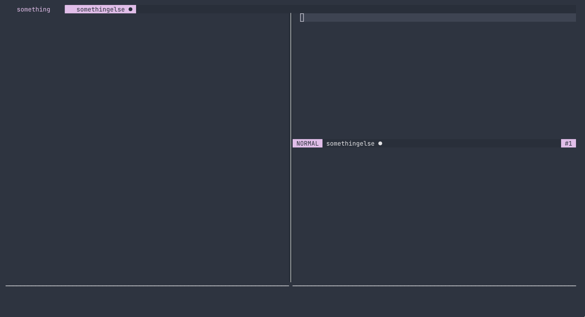

I've been playing around and configuring Vim as an IDE for a while and so far I'm very happy with it. Sure it has a few problems and it's not as stable as something like Intellij Idea, however, it makes up for it by offering extreme customizability and comfort. However, one of the main things that I feel lacking is visual cleanliness. While having your editor directly on your terminal has its uses, it also means that users are quite limited when tweaking its appearance. 

### Neovim's default look

Vim's default split separators look like this: 



Vim also provides the option `fillchars` to specify different characters used for the UI, and so, we can change the look of our vertical separators by specifying: 

```lisp
(vim.opt.fillchars:append "vert:│")
```




### Horizontal separators

Vim doesn't have a concept of horizontal separators, it's the status bar that marks the end of a buffer. This is something I personally don't like, having a status bar per split, in my opinion, only clutters the interface. Thus I thought I could replace the status bar with a horizontal straight line.

In my case, I'm using [Feline](https://github.com/famiu/feline.nvim) as my status bar. It is configured by defining a set of providers that generate the information displayed as strings.

We can simply define a provider that fills the status bar with the character `─`. We should take the width of our current split window so that the characters don't overflow: 

```lisp 
(defn inactive-separator-provider []
    (string.rep "─" (vim.api.nvim_win_get_width 0)))
```

We only want to use this provider for inactive windows, as we still want to display our usual status bar in the window that's currently focused. Luckily, Feline has a specific table for this called `components.inactive`:

```lisp 
(tset components.inactive 1
     [{:provider inactive-separator-provider 
       :hl {:bg "NONE" :fg horiz-separator-color}}])
```

Finally, we should also override the background and foreground colors so that they look the same way as the vertical separators:

```lisp
(feline.setup 
  {:default_hl  
    {:inactive 
      {:fg horiz-separator-color 
       :bg "NONE"}}
   :components components})
```



### Using our separator only where it matters

There's still one thing that bothers me though, windows at the bottom of the screen shouldn't really need a separator below them. My first approach was to check the position of the window relative to the rest, by using its coordinates. I wouldn't recommend doing this, as it is quite ugly and might give problems if we resize our terminal. The way I ended up going for was to use the `winnr` function. This function works as it follows: 

```txt
winnr([{arg}])  The result is a Number, which is the number of the current
                window.  The top window has number 1.

                The optional argument {arg} supports the following values:
                        ...
                        {N}j    the number of the Nth window below the
                                current window (where CTRL-W_j goes to).
			...
```

If there isn't any window next, the function will return the id of the current one, thus, we can add a check in our `inactive-separator-provider` as follows: 
```lisp 
(defn inactive-separator-provider []
  (if (not= (vim.fn.winnr) (vim.fn.winnr :j))
    (string.rep "─" (vim.api.nvim_win_get_width 0))
    ""))
```

The final result looks something like this: 


### Other options I'd like to try

There are still some things that I haven't gotten around to implement, such as having both a status line and a horizontal separator below it at the same time. However, that might prove complicated due to Vim not supporting multiline status bars. Another interesting option might be having a global statusline for all windows, this might be possible by using floating windows. I don't know. Anyway ^^


