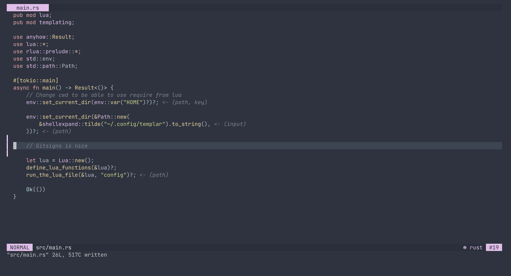

I've recently finished writing the config for my editor. I was particularly interested in trying out [Aniseed](https://github.com/Olical/aniseed), a plugin that allows me to run Fennel (a Lisp-like language that compiles to Lua) within Neovim. 

I was also curious to see how fast my startup times could get using Lua instead of vimscript, specially when combining it with [Packer](https://github.com/wbthomason/packer.nvim) and [impatient.nvim](https://github.com/lewis6991/impatient.nvim).

Anyway, [here is my new config](https://github.com/druskus20/dots/tree/master/nvim/.config/nvim)!
